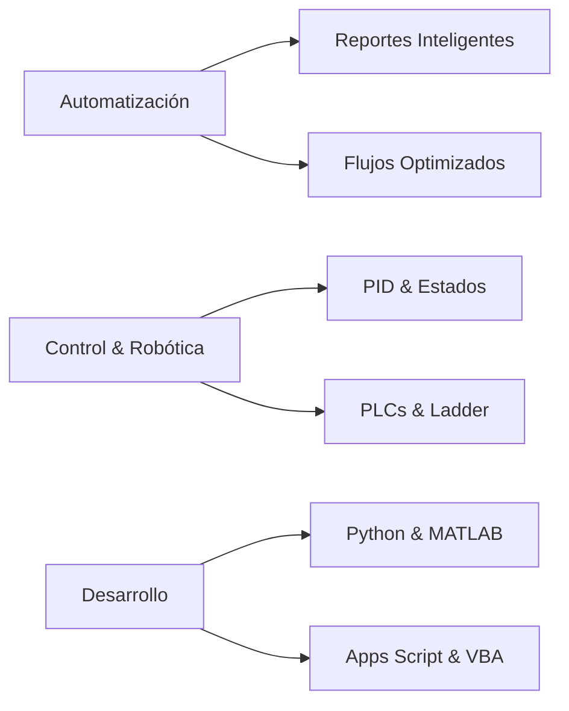

# 👋 Hola, soy Carlos (pero me dicen Charlie)

### Ingeniero Mecatrónico | Automatización & Control | Geek del Café ☕

---

## 🎯 Sobre mí

Estudiante de Ingeniería Mecatrónica con **fanatismo serio por el café**, los deportes y la música. Geek a tiempo completo y **experto empírico en IAs**.

Me muevo feliz entre **control, automatización y software**: lo que pueda medir, modelar o automatizar… me lo llevo.

> *Traducción no geek: hago que las cosas funcionen mejor, solito o en equipo.*

---

## 💼 Lo que hago (y disfruto)

🔧 **Automatización de procesos**  
Desde reportes con **Excel + VBA** hasta flujos completos en **Google Workspace con Apps Script**

🤖 **Control y robótica**  
Control clásico (**PID, espacio de estados**), lógica **Ladder** y PLCs (TIA Portal / Studio 5000)

💻 **Programación para analizar y crear**  
**Python** y **MATLAB/Simulink** para datos, simulación y prototipos

⚙️ **Diseño y fabricación**  
Del modelo al mundo real: **Inventor / AutoCAD** y todo lo necesario para materializar ideas

---

## 🛠️ Stack Tecnológico

### Lenguajes & Frameworks

### Control & Automatización

### Herramientas & Diseño

**Especialidades:**
- Control PID y espacio de estados
- Programación Ladder para PLCs
- APIs de Google Workspace
- Robótica (RobotStudio)
- CAD/CAE (ANSYS cuando toca)

> 💡 Si hay que conectar sensores, microcontroladores o APIs para que todo fluya, me apunto.

---

## 🚀 Proyectos & Logros Recientes

<table>
<tr>
<td width="50%">

### 📊 Automatización Inteligente
- Reportes automáticos con **VBA** y **Apps Script**
- Menos clics, más señales útiles
- Dashboards dinámicos y actualizables

</td>
<td width="50%">

### 📁 Trazabilidad & Estandarización
- Flujos documentales optimizados
- Sistemas de trazabilidad robustos
- Integración entre plataformas

</td>
</tr>
<tr>
<td width="50%">

### ⚡ Optimización de Procesos
- Mejora de sistemas "legacy"
- Reducción de tiempos operativos
- Automatización end-to-end

</td>
<td width="50%">

### 🔧 Control & Prototipado
- Implementación de controladores
- Simulación y validación
- Del modelo a la producción

</td>
</tr>
</table>

---

## 📬 Hablemos

¿Necesitas **automatizar algo**, bajar tiempos de un proceso o prototipar control?

**Dispara el mensaje. Si hay café, mejor.** ☕😄

📧 **Email:** [cquinteroca@unal.edu.co](mailto:cquinteroca@unal.edu.co)  
💼 **LinkedIn:** [Carlos Fernando Quintero](https://linkedin.com/in/carlos-fernando-quintero-8ba0821a5)

---

### 🤓 PS

Sí, soy ese **geek** que disfruta explicar lo complejo en fácil.  
Si algo de acá te llamó la atención, te muestro el "cómo" sin humo.

---

*"Automatizar hoy lo que te quitará tiempo mañana"* ⚡

